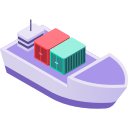

[![Contributors][contributors-shield]][contributors-url]
[![Forks][forks-shield]][forks-url]
[![Stargazers][stars-shield]][stars-url]
[![Issues][issues-shield]][issues-url]
[![MIT License][license-shield]][license-url]


[![LinkedIn][linkedin-shield]][linkedin-url]

<!-- PROJECT LOGO -->
<br />
<p align="center">
  <a href="https://github.com/Adityacprtm/gke-deployment">
    
  </a>

  <h2 align="center">GKE Deployment</h2>

  <p align="center">
    A container to support K8s deployment on GKE
    <br />
    <a href="https://github.com/Adityacprtm/gke-deployment"><strong>Explore the docs »</strong></a>
    <br />
    <br />
    <a href="https://github.com/Adityacprtm/gke-deployment">View Demo</a>
    ·
    <a href="https://github.com/Adityacprtm/gke-deployment/issues">Report Bug</a>
    ·
    <a href="https://github.com/Adityacprtm/gke-deployment/issues">Request Feature</a>
  </p>
</p>

<!-- ABOUT THE PROJECT -->
## About The Project

A container to support K8s deployment on GKE

| Tools            | Version |
| ---------------- | ------- |
| git              | 2.32.0  |
| openssh          |         |
| python           | 3.9.5   |
| Google Cloud SDK | 358.0.0 |
| docker-cli       | 20.10.7 |
| Kubectl          | latest  |
| helm             | v3.7.0  |
| consul-template  | v0.27.1 |
| dotenv-linter    | v3.1.0  |
| validtoml        | latest  |

### Built With

* [Docker](https://docker.com/)

<!-- GETTING STARTED -->
## Getting Started

To get a local copy up and running follow these simple steps.

### Prerequisites

This is an example of how to list things you need to use the software and how to install them.

* Docker

### Installation

1. Customize *tools version* in `Dockerfile`.

2. Change *image name* and *container registry* if you are not use docker hub

3. Run

    ```shell
    chmod +x build-push.sh
    ./build-push.sh <TAG_VERSION>
    ```

<!-- USAGE EXAMPLES -->
## Usage

### Docker

```shell
docker run -v /home/user/.config/gcloud:/root/.config/gcloud -v /home/user/dev/lion/.kube:/root/.kube --rm -it adityacprtm/gke-deployment:latest bash
```

### Jenkins

Can also mount like `.ssh`, `.consul-template config`, `hosts`, etc.

```shell
docker.image('adityacprtm/gke-deployment').inside('-v /home/user/.config/gcloud:/root/.config/gcloud -v /home/user/.kube:/root/.kube'){
    # do something
}
```

<!-- ROADMAP -->
## Roadmap

See the [open issues](https://github.com/Adityacprtm/gke-deployment/issues) for a list of proposed features (and known issues).

<!-- CONTRIBUTING -->
## Contributing

Contributions are what make the open source community such an amazing place to be learn, inspire, and create. Any contributions you make are **greatly appreciated**.

1. Fork the Project
2. Create your Feature Branch (`git checkout -b feature/AmazingFeature`)
3. Commit your Changes (`git commit -m 'Add some AmazingFeature'`)
4. Push to the Branch (`git push origin feature/AmazingFeature`)
5. Open a Pull Request

<!-- LICENSE -->
## License

Distributed under the MIT License. See `LICENSE` for more information.

<!-- CONTACT -->
## Contact

Your Name - [@adityacprtm](https://twitter.com/adityacprtm) - pratamaditya7@gmail.com

Project Link: [https://github.com/Adityacprtm/gke-deployment](https://github.com/Adityacprtm/gke-deployment)

<!-- ACKNOWLEDGEMENTS -->
## Acknowledgements

* [Img Shields](https://shields.io)
* [Choose an Open Source License](https://choosealicense.com)
* [Docker](https://docker.com/)
* [Helm](https://helm.sh/)
* [Consul Template](https://github.com/hashicorp/consul-template)
* [Dotenv Linter](https://github.com/dotenv-linter/dotenv-linter)
* [Validtoml](https://github.com/Adityacprtm/validtoml) fork from [Validtoml](https://github.com/martinlindhe/validtoml)
* Icons made by [Freepik](href="https://www.freepik.com) from [Flaticon](https://www.flaticon.com/)

<!-- MARKDOWN LINKS & IMAGES -->
<!-- https://www.markdownguide.org/basic-syntax/#reference-style-links -->
[contributors-shield]: https://img.shields.io/github/contributors/adityacprtm/gke-deployment
[contributors-url]: https://github.com/Adityacprtm/gke-deployment/graphs/contributors
[forks-shield]: https://img.shields.io/github/forks/adityacprtm/gke-deployment
[forks-url]: https://github.com/Adityacprtm/gke-deployment/network/members
[stars-shield]: https://img.shields.io/github/stars/adityacprtm/gke-deployment
[stars-url]: https://github.com/Adityacprtm/gke-deployment/stargazers
[issues-shield]: https://img.shields.io/github/issues/Adityacprtm/gke-deployment
[issues-url]: https://github.com/Adityacprtm/gke-deployment/issues
[license-shield]: https://img.shields.io/github/license/Adityacprtm/gke-deployment
[license-url]: https://github.com/Adityacprtm/gke-deployment/blob/develop/LICENSE
[linkedin-shield]: https://img.shields.io/badge/-LinkedIn-black?logo=linkedin&colorB=555
[linkedin-url]: https://linkedin.com/in/adityacprtm